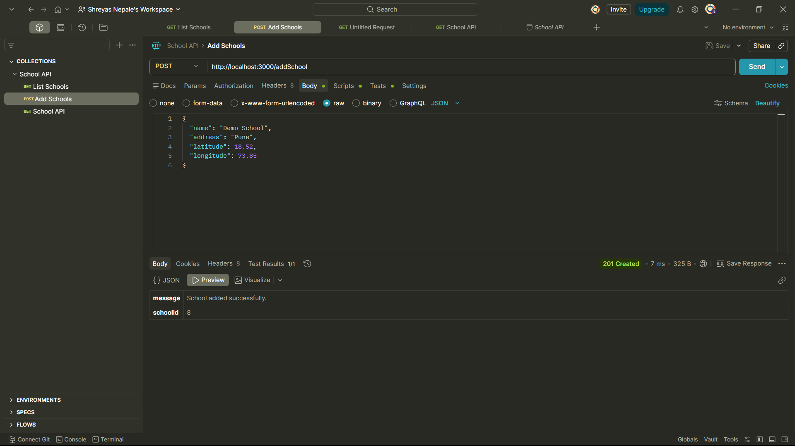
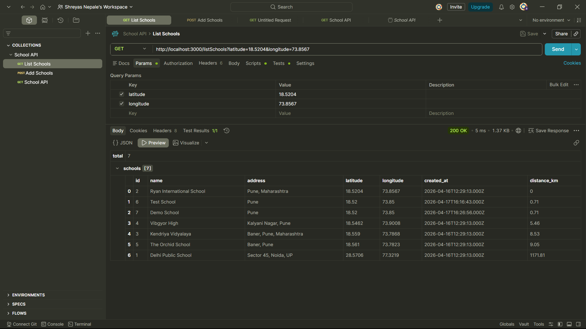

# Smart School Finder API

A location-based REST API built using Node.js, Express.js, and MySQL that allows users to add schools and retrieve them sorted by geographical proximity using the Haversine formula.

---

## Overview

This project demonstrates backend API development with real-world functionality, including geolocation-based sorting and database integration.

---

## Features

* Add schools with latitude and longitude coordinates
* Retrieve schools sorted by distance from a given location
* Accurate distance calculation using the Haversine formula..
* Clean and modular backend architecture
* RESTful API design

---

## Screenshots

### Add School API (POST)



### List Schools API (GET)



---

## Tech Stack

* Node.js
* Express.js
* MySQL
* Postman

---

## Project Structure

```
school-api/
├── controllers/
├── routes/
├── db.js
├── server.js
├── package.json
├── setup.sql
├── .env.example
```

---

## API Endpoints

### Add School

**POST** `/addSchool`

```json
{
  "name": "ABC School",
  "address": "Pune",
  "latitude": 18.52,
  "longitude": 73.85
}
```

---

### List Schools

**GET** `/listSchools?latitude=18.5204&longitude=73.8567`

```json
{
  "total": 2,
  "schools": [
    {
      "name": "Test School",
      "distance_km": 0.71
    }
  ]
}
```

---

## Setup Instructions

```bash
npm install
mysql -u root -p < setup.sql
npm start
```

---

## Deployment

This API can be deployed using:

* Render (backend hosting)
* Railway (MySQL database hosting)

---
fix deployment issue

## Author

Shreyas Nepale
